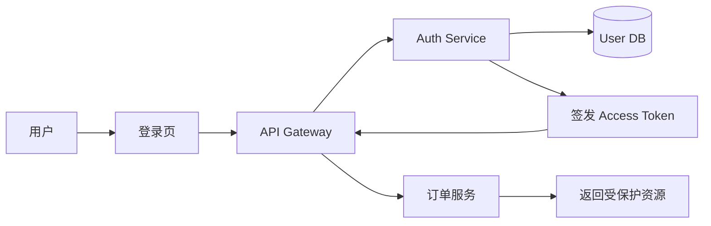
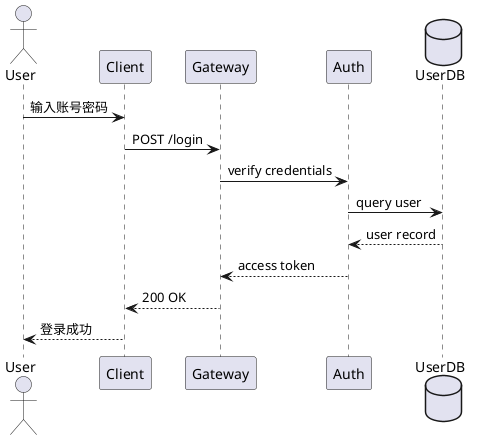
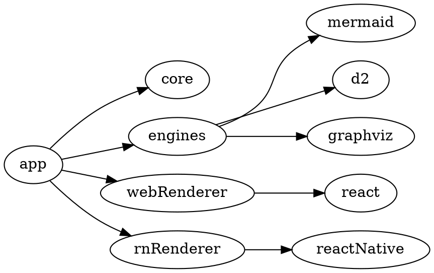

# Supramark 能力介绍

Supramark 是面向 React Web 与 React Native 的 Markdown、图表和卡片渲染集成层。它把 Markdown 源码解析为带 source map 的 AST v2，再通过 Feature 体系、统一图表引擎和平台 renderer 渲染成 Web / RN UI，适合聊天消息、文档预览、AI 回复和富内容卡片等场景。

> 在 Askaway 中的场景：作为对话消息数据的渲染集成层，将消息以统一的 Web / RN UI 展示<br />
> 简单来说，对话中的回答方返回的消息数据必须遵守 `supramark` 支持的格式

[在线预览](https://actrium.github.io/supramark/preview/?feature=admonition)

## 支持能力

### 基础与扩展语法

| 能力 | 语法 | 预览 |
| --- | --- | --- |
| Core Markdown（CommonMark 标准） | `# Title`<br>`**bold**`<br>`- item` | [预&#8288;览](https://actrium.github.io/supramark/preview/?feature=core-markdown) |
| Image | `` | [预&#8288;览](https://actrium.github.io/supramark/preview/?feature=core-markdown) |
| GFM（GitHub Flavored Markdown，GitHub 对标准 Markdown 的扩展） | `- [x] done`<br>`~~deleted~~`<br>`\| a \| b \|` | [预&#8288;览](https://actrium.github.io/supramark/preview/?feature=gfm) |
| Math / LaTeX | `$E=mc^2$` | [预&#8288;览](https://actrium.github.io/supramark/preview/?feature=math) |
| Footnote | `text[^1]`<br>`[^1]: note` | [预&#8288;览](https://actrium.github.io/supramark/preview/?feature=footnote) |
| Definition List | `HTTP`<br>`: application protocol` | [预&#8288;览](https://actrium.github.io/supramark/preview/?feature=definition-list) |
| Emoji | `:smile: :rocket:` | [预&#8288;览](https://actrium.github.io/supramark/preview/?feature=emoji) |
| Code Highlight | ` ```ts `<br>`const x = 1`<br>` ``` ` | [预&#8288;览](https://actrium.github.io/supramark/preview/?feature=core-markdown) |

#### Math / LaTeX 示例

行内公式：质能方程 $E = mc^2$。

块级公式：

$$
\frac{1}{\sqrt{2\pi\sigma^2}}
e^{-\frac{(x-\mu)^2}{2\sigma^2}}
$$

### 容器与卡片

`:::` 容器语法负责把结构化内容从普通 Markdown 中抽出来，宿主可以按平台选择原生组件渲染。

<table>
  <thead>
    <tr>
      <th>能力</th>
      <th>语法</th>
      <th>预览</th>
    </tr>
  </thead>
  <tbody>
    <tr>
      <td>Admonition</td>
      <td><code>:::note Title</code><br><code>content</code><br><code>:::</code></td>
      <td><a href="https://actrium.github.io/supramark/preview/?feature=admonition">预&#8288;览</a></td>
    </tr>
    <tr>
      <td>HTML Page</td>
      <td><code>:::html</code><br><code>&lt;p&gt;hello&lt;/p&gt;</code><br><code>:::</code></td>
      <td><a href="https://actrium.github.io/supramark/preview/?feature=html-page">预&#8288;览</a></td>
    </tr>
    <tr>
      <td>Map</td>
      <td><code>:::map</code><br><code>center: [34.05, -118.24]</code><br><code>zoom: 12</code><br><code>:::</code></td>
      <td><a href="https://actrium.github.io/supramark/preview/?feature=map">预&#8288;览</a></td>
    </tr>
    <tr>
      <td>Weather</td>
      <td><code>:::weather</code><br><code>location: Beijing</code><br><code>:::</code></td>
      <td><a href="https://actrium.github.io/supramark/preview/?feature=weather">预&#8288;览</a></td>
    </tr>
    <tr>
      <td>Video【待&#8288;定】</td>
      <td><code>:::video</code><br><code>{</code><br><code>"src": "https://…mp4",</code><br><code>"poster": "https://…jpg",</code><br><code>"title": "Product demo",</code><br><code>"autoplay": false,</code><br><code>"muted": false,</code><br><code>"loop": false,</code><br><code>"controls": true,</code><br><code>"width": 100</code><br><code>}</code><br><code>:::</code></td>
      <td>Doing 【语法格式后续可能变动】</td>
    </tr>
  </tbody>
</table>


### 图表能力

图表语法统一使用 fenced code block。D2、Mermaid、PlantUML 在 Web 使用 Rust WASM，在 React Native 使用 Rust FFI；ECharts 与 Vega / Vega-Lite 使用 JS/TS 引擎输出 SVG。

| 能力 | 语法 | 预览 |
| --- | --- | --- |
| Mermaid | ` ```mermaid `<br>`graph TD; A-->B`<br>` ``` ` | [预&#8288;览](https://actrium.github.io/supramark/preview/?feature=mermaid) |
| D2 | ` ```d2 `<br>`user -> api: request`<br>` ``` ` | [预&#8288;览](https://actrium.github.io/supramark/preview/?feature=d2) |
| PlantUML | ` ```plantuml `<br>`@startuml`<br>`A -> B`<br>`@enduml`<br>` ``` ` | [预&#8288;览](https://actrium.github.io/supramark/preview/?feature=plantuml) |
| DOT / Graphviz | ` ```dot `<br>`digraph G { A->B }`<br>` ``` ` | [预&#8288;览](https://actrium.github.io/supramark/preview/?feature=diagram-dot) |
| ECharts | ` ```echarts `<br>`{"series":[]}`<br>` ``` ` | [预&#8288;览](https://actrium.github.io/supramark/preview/?feature=diagram-echarts) |
| Vega / Vega-Lite | ` ```vega-lite `<br>`{"mark":"bar"}`<br>` ``` ` | [预&#8288;览](https://actrium.github.io/supramark/preview/?feature=diagram-vega-lite) |

### 图表使用场景

#### 1. 用 Mermaid 展示登录与鉴权流程

适合业务流程、状态流转和产品逻辑说明。



#### 2. 用 D2 展示系统调用架构

适合技术方案评审中的服务边界、依赖关系和部署结构。

```d2
user: User

web: Web App {
  ui: React Web
}

backend: Backend {
  gateway: API Gateway
  auth: Auth Service
  order: Order Service
  db: PostgreSQL
}

user -> web.ui: HTTPS
web.ui -> backend.gateway: REST API
backend.gateway -> backend.auth: verify token
backend.gateway -> backend.order: route request
backend.order -> backend.db: query orders
```

#### 3. 用 PlantUML 展示接口时序

适合软件设计文档、跨系统调用和异常场景说明。



#### 4. 用 DOT / Graphviz 展示模块依赖

适合依赖分析、构建关系和状态机说明。



#### 5. 用 ECharts 展示业务指标

适合在文档或 AI 回复中嵌入请求量、延迟、错误率等指标片段。

```echarts
{
  "xAxis": {
    "type": "category",
    "data": ["Mon", "Tue", "Wed", "Thu", "Fri"]
  },
  "yAxis": { "type": "value" },
  "series": [
    {
      "name": "API requests",
      "type": "line",
      "smooth": true,
      "data": [1200, 1800, 1650, 2100, 2400]
    }
  ]
}
```

#### 6. 用 Vega-Lite 展示数据分析结果

适合声明式统计图和数据洞察说明。

```vega-lite
{
  "data": {
    "values": [
      { "category": "Web", "requests": 320 },
      { "category": "iOS", "requests": 260 },
      { "category": "Android", "requests": 220 }
    ]
  },
  "mark": "bar",
  "encoding": {
    "x": { "field": "category", "type": "nominal" },
    "y": { "field": "requests", "type": "quantitative" }
  }
}
```


